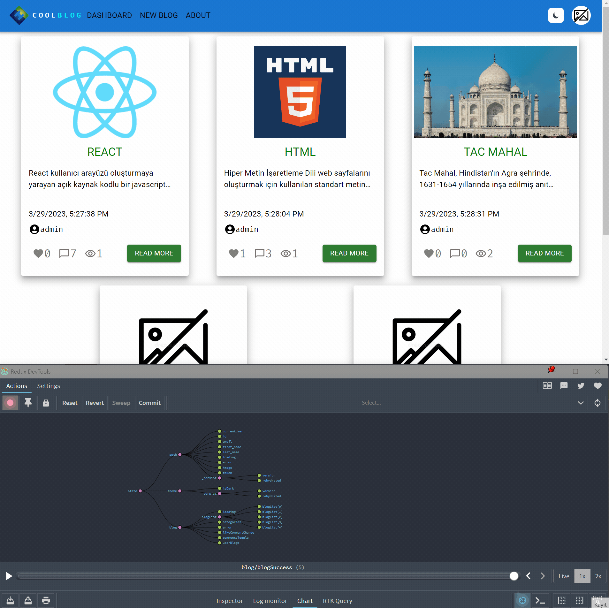

<div align=center>
	<h1>Blog App</h1>
</div>

<div align="center">
	<a href="https://blog-app-ehkarabas.netlify.app/">
		
	</a>
	<br>
	
	
	
</div>

## Description

A React app that requires user authentication for access to certain sections, works integrated with a backend API, allowing users to publish blog posts or save drafts, and provides interaction opportunities such as liking and commenting on blog posts for registered users. Registered users are granted permission to exclusively view their own created blog posts, as well as edit and delete them. All forms are structured with Formik and validated with Yup. Theme toggling and authentication processes are stored using Redux Persist, ensuring that logged-in users can access restricted sections and the selected theme will continue to work even if the page is refreshed.

## Goals

Practicing on components, props, tailwind, MUI, theme toggling(via tailwind, MUI and redux persist), redux, redux-toolkit(slices, configureStore), axios(custom hook containing instance with authorization configuration), using multiple hooks in another hook via custom hooks, react-router(private router included), .env(to hide API datas), _redirect file in case of refreshing issues on host, taostify, formik to configure and yup to validate forms, React hooks.

## Installation

To run this app on your local, run commands below on the terminal:

1. Clone main repo on your local.
    ```shell
    $ git clone https://github.com/ehkarabas/react-exercises.git
    ```

2. Install node modules to this sub-repo.
    ```shell
    $ yarn install
    
    or

    $ npm install
    ```

3. Run the app on your browser.
    ```shell
    $ yarn start
    
    or

    $ npm start
    ```

## Resource Structure 

```
blog-app(folder)
|
|-- README.md
|-- package.json
|-- public
|   |-- _redirect
|   |-- images
|   |   |-- blog-app-presentation1.gif
|   |   |-- blog-app-presentation2.gif
|   |   |-- blog-app-presentation3.gif
|   |   |-- ehlogo-transparent.png
|   |-- index.html
|-- src
|   |-- App.js
|   |-- app
|   |   |-- store.js
|   |-- assets
|   |   |-- FavIcon.js
|   |-- components
|   |   |-- FavComp.jsx
|   |   |-- Footer.jsx
|   |   |-- Navbar.jsx
|   |   |-- ThemeProviderWrapper.jsx
|   |   |-- ThemeToggle.jsx
|   |   |-- auth
|   |   |   |-- LoginForm.jsx
|   |   |   |-- RegisterForm.jsx
|   |   |-- blog
|   |       |-- BlogCard.jsx
|   |       |-- CommentCard.jsx
|   |       |-- CommentForm.jsx
|   |       |-- DeleteModal.jsx
|   |       |-- DetailsBlogCard.jsx
|   |       |-- MyBlogsBlogCard.jsx
|   |       |-- UpdateModal.jsx
|   |-- features
|   |   |-- authSlice.jsx
|   |   |-- blogSlice.jsx
|   |   |-- themeSlice.jsx
|   |-- helper
|   |   |-- ToastNotify.js
|   |-- hooks
|   |   |-- useAuthCall.jsx
|   |   |-- useAxios.jsx
|   |   |-- useBlogCall.jsx
|   |-- index.css
|   |-- index.js
|   |-- pages
|   |   |-- About.jsx
|   |   |-- Dashboard.jsx
|   |   |-- Detail.jsx
|   |   |-- Login.jsx
|   |   |-- MyBlogs.jsx
|   |   |-- NewBlog.jsx
|   |   |-- NotFound.jsx
|   |   |-- Profile.jsx
|   |   |-- Register.jsx
|   |-- rooter
|       |-- AppRouter.jsx
|       |-- PrivateRouter.jsx
|-- tailwind.config.js
|-- yarn.lock
```