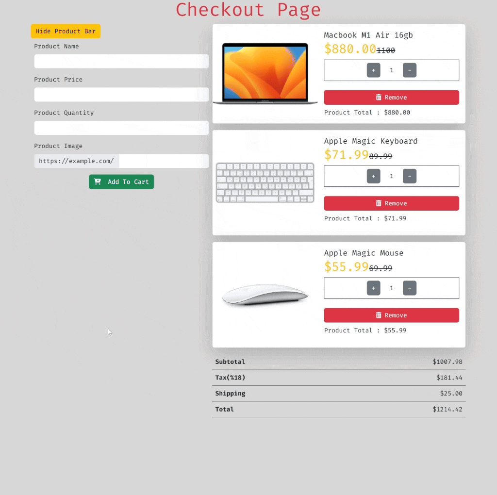

<div align=center>
	<h1>Checkout Page</h1>
</div>

<div align="center">
	<a href="https://checkout-page-ehkarabas.netlify.app/">
		
	</a>
	<br>
	
</div>

## Description

A React app that simulates shopping carts in e-commerce websites where products can be added and removed.

## Goals

Practicing on components, props, react-bootstrap, external styling, SASS, array methods chaining(for summing), use state and use effect hooks.

## Installation

To run this app on your local, run commands below on the terminal:

1. Clone main repo on your local.
    ```shell
    $ git clone https://github.com/ehkarabas/react-exercises.git
    ```

2. Install node modules to this sub-repo.
    ```shell
    $ yarn install
    
    or

    $ npm install
    ```

3. Run the app on your browser.
    ```shell
    $ yarn start
    
    or

    $ npm start
    ```

## Resource Structure 

```
checkout-page(folder)
|
|-- README.md
|-- package.json
|-- public
|   |-- images
|   |   |-- checkout-page-presentation.gif
|   |-- index.html
|-- src
|   |-- App.js
|   |-- components
|   |   |-- AddProduct.jsx
|   |   |-- Buttons.jsx
|   |   |-- CardTotal.jsx
|   |   |-- Header.jsx
|   |   |-- ProductCard.jsx
|   |-- helper
|   |   |-- data.js
|   |-- index.js
|   |-- index.scss
|   |-- pages
|   |   |-- Main.jsx
|   |-- scss
|       |-- _mixins.scss
|       |-- _reset.scss
|       |-- _variables.scss
|-- yarn.lock
```