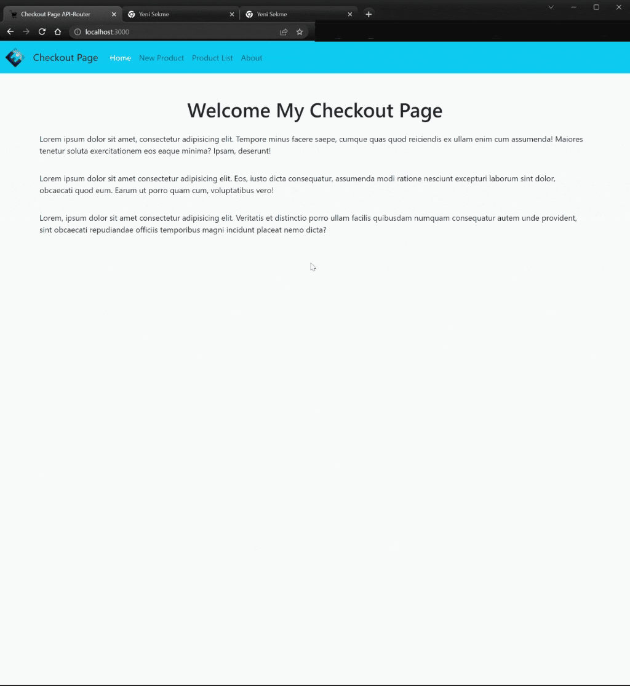

<div align=center>
	<h1>Checkout Page API-Router</h1>
</div>

<div align="center">
	<a href="https://checkout-page-api-router-ehkarabas.netlify.app/">
		
	</a>
	<br>
	
</div>

## Description

A React app that simulates shopping carts on e-commerce websites that receive and update product data through an API and allow for adding and removing products through 3 different tabs. The system has a structure where it adds product names in a specific format to the end of the product list URL based on their names in the API. When trying to access a product update externally by entering a URL, the system compares the entered URL with the product names in the API in the specified format. If there is a match, the system allows the relevant product to be opened in the product update panel.

## Goals

Practicing on components, props, bootstrap, API(get,post,put,delete), react-router, .env(to hide API URL), useState, useEffect, useNavigate, useLocation and useParams hooks.

## Installation

To run this app on your local, run commands below on the terminal:

1. Clone main repo on your local.
    ```shell
    $ git clone https://github.com/ehkarabas/react-exercises.git
    ```

2. Install node modules to this sub-repo.
    ```shell
    $ yarn install
    
    or

    $ npm install
    ```

3. Run the app on your browser.
    ```shell
    $ yarn start
    
    or

    $ npm start
    ```

## Resource Structure 

```
checkoutpage-api-router(folder)
|
|-- README.md
|-- package.json
|-- public
|   |-- images
|   |   |-- checkoutpage-api-router-presentation.gif
|   |   |-- ehlogo-transparent.png
|   |-- index.html
|-- src
|   |-- App.js
|   |-- components
|   |   |-- CardTotal.jsx
|   |   |-- Navbar.jsx
|   |   |-- NotFound.jsx
|   |   |-- ProductCard.jsx
|   |   |-- ProductForm.jsx
|   |-- index.css
|   |-- index.js
|   |-- pages
|       |-- About.jsx
|       |-- Main.jsx
|       |-- NewProduct.jsx
|       |-- ProductList.jsx
|       |-- UpdateProduct.jsx
|-- yarn.lock
```