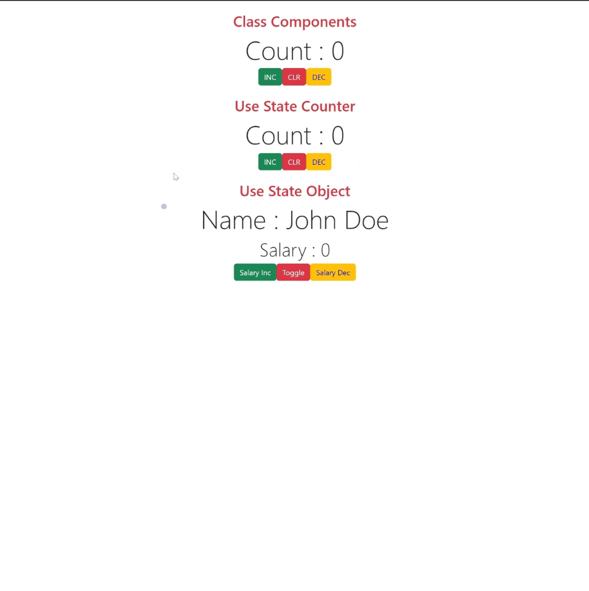

<div align=center>
	<h1>Counters</h1>
</div>

<div align="center">
	<a href="https://counters-ehkarabas.netlify.app/">
		
	</a>
	<br>
	
</div>

## Description

Simple react app for counters via changing UI with buttons that built with react class/functional components.

## Goals

Practicing on components, events, class states and use state hooks.

## Installation

To run this app on your local, run commands below on the terminal:

1. Clone main repo on your local.
    ```shell
    $ git clone https://github.com/ehkarabas/react-exercises.git
    ```

2. Install node modules to this sub-repo.
    ```shell
    $ yarn install
    
    or

    $ npm install
    ```

3. Run the app on your browser.
    ```shell
    $ yarn start
    
    or

    $ npm start
    ```

## Resource Structure 

```
counters(folder)
|
|-- README.md
|-- package.json
|-- public
|   |-- images
|   |   |-- counters-presentation.gif
|   |-- index.html
|-- src
|   |-- App.js
|   |-- components
|   |   |-- classComponent
|   |   |   |-- Counter.jsx
|   |   |-- useStateHook
|   |       |-- UseStateCounter.jsx
|   |       |-- UseStateObject.jsx
|   |-- index.js
|-- yarn.lock
```


