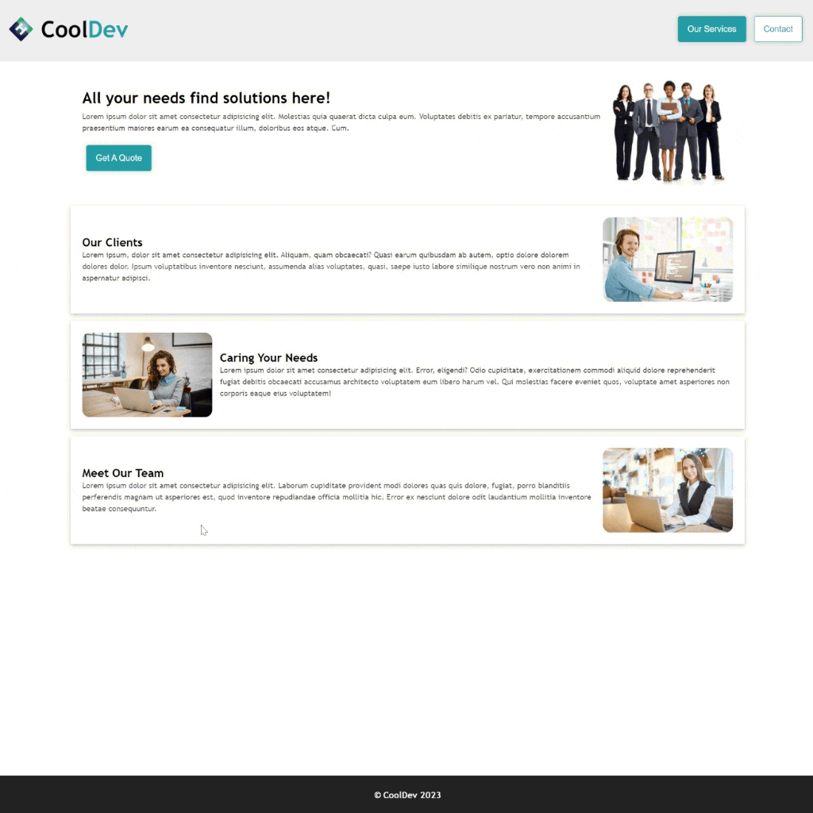

<div align=center>
	<h1>Landing With Styled Components</h1>
</div>

<div align="center">
	<a href="https://landing-styledcomp-ehkarabas.netlify.app/">
		
	</a>
	<br>
	
</div>

## Description

Simple React app for a landing page designed with styled components.

## Goals

Practicing on components, props, styled components(createGlobalStyle, ThemeProvider, css, props).

## Installation

To run this app on your local, run commands below on the terminal:

1. Clone main repo on your local.
    ```shell
    $ git clone https://github.com/ehkarabas/react-exercises.git
    ```

2. Install node modules to this sub-repo.
    ```shell
    $ yarn install
    
    or

    $ npm install
    ```

3. Run the app on your browser.
    ```shell
    $ yarn start
    
    or

    $ npm start
    ```

## Resource Structure 

```
landing-styledcomp(folder)
|
|-- README.md
|-- package.json
|-- public
|   |-- images
|   |   |-- clients.jpg
|   |   |-- ehlogo-transparent.png
|   |   |-- hero.png
|   |   |-- landing-styledcomp-presentation.gif
|   |   |-- meet.jpg
|   |   |-- support.jpg
|   |-- index.html
|-- src
|   |-- App.js
|   |-- components
|   |   |-- Card.jsx
|   |   |-- Footer.jsx
|   |   |-- Header.jsx
|   |   |-- Navbar.jsx
|   |   |-- styled
|   |       |-- Button.styled.jsx
|   |       |-- Container.styled.jsx
|   |       |-- FlexColumn.styled.jsx
|   |       |-- FlexRow.styled.jsx
|   |       |-- Footer.styled.jsx
|   |       |-- GlobalStyles.styled.jsx
|   |       |-- Image.styled.jsx
|   |       |-- Nav.styled.jsx
|   |-- data.js
|   |-- index.js
|-- yarn.lock
```


