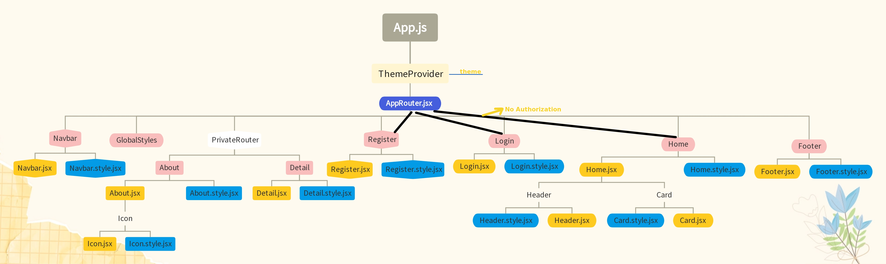

<div align=center>
	<h1>Library App</h1>
</div>

<div align="center">
	<a href="https://library-app-ehkarabas.netlify.app/">
		
	</a>
	<br>
	
	<p><i>Main Structure</i></p>
	
</div>

## Description

A React app that simulates library websites that receive book/magazine data through Google Books API and allow for querying books/magazines through different tabs. The system has a structure where it adds query names in a specific format to the end of the query URL. Accessing to the some sections requires authorization, login data is stored in the session storage, and registration data is stored in the local storage.

## Goals

Practicing on components, props, styled components, API(get with different query parameters of the API), react-router, .env(to hide API key), sweetalert2, useState, useNavigate, useLocation, useParams and useContext(for theme toggling structure) hooks.

## Installation

To run this app on your local, run commands below on the terminal:

1. Clone main repo on your local.
    ```shell
    $ git clone https://github.com/ehkarabas/react-exercises.git
    ```

2. Install node modules to this sub-repo.
    ```shell
    $ yarn install
    
    or

    $ npm install
    ```

3. Run the app on your browser.
    ```shell
    $ yarn start
    
    or

    $ npm start
    ```

## Resource Structure 

```
library-app(folder)
|
|-- README.md
|-- package.json
|-- public
|   |-- images
|   |   |-- ehlogo-transparent.png
|   |   |-- library-app-presentation.gif
|   |   |-- main-structure.png
|   |-- index.html
|-- src
|   |-- App.js
|   |-- assets
|   |   |-- about.png
|   |   |-- book.jpg
|   |   |-- books.jpg
|   |   |-- const.png
|   |-- components
|   |   |-- card
|   |   |   |-- Card.jsx
|   |   |   |-- Card.style.jsx
|   |   |-- darkLightToggle
|   |   |   |-- DarkLightToggle.jsx
|   |   |   |-- DarkLightToggle.style.jsx
|   |   |-- footer
|   |   |   |-- Footer.jsx
|   |   |   |-- Footer.style.jsx
|   |   |-- header
|   |   |   |-- Header.jsx
|   |   |   |-- Header.style.jsx
|   |   |-- icon
|   |   |   |-- Icon.jsx
|   |   |   |-- Icon.style.jsx
|   |   |-- navbar
|   |       |-- Navbar.jsx
|   |       |-- Navbar.style.jsx
|   |-- context
|   |   |-- darkLightContext.js
|   |-- helper
|   |   |-- iconData.js
|   |-- index.js
|   |-- pages
|   |   |-- about
|   |   |   |-- About.jsx
|   |   |   |-- About.style.jsx
|   |   |-- detail
|   |   |   |-- Detail.jsx
|   |   |   |-- Detail.style.jsx
|   |   |-- home
|   |   |   |-- Home.jsx
|   |   |   |-- Home.style.jsx
|   |   |   |-- Query.jsx
|   |   |-- login
|   |   |   |-- Login.jsx
|   |   |   |-- Login.style.jsx
|   |   |-- register
|   |       |-- Register.jsx
|   |       |-- Register.style.jsx
|   |-- router
|   |   |-- AppRouter.jsx
|   |   |-- PrivateRouter.jsx
|   |-- styles
|       |-- Flex.jsx
|       |-- Global.styles.jsx
|       |-- theme.js
|-- yarn.lock
```