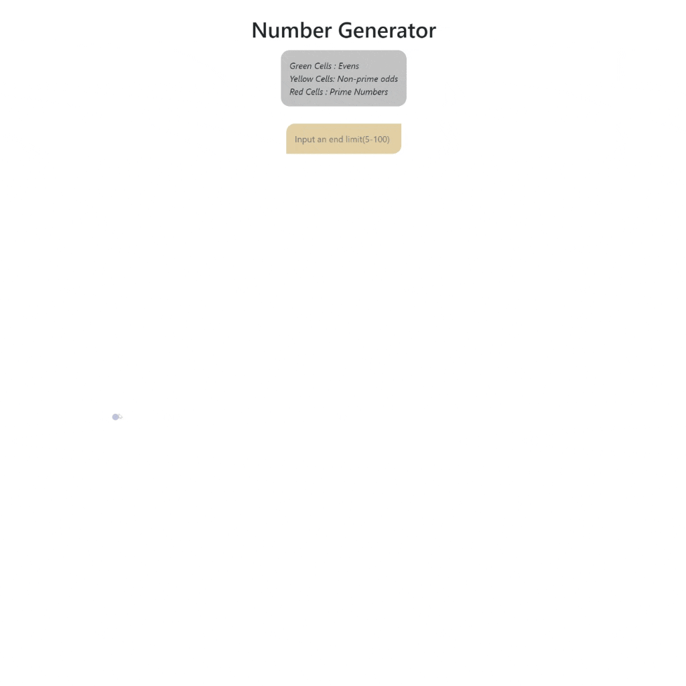

<div align=center>
	<h1>Number Generator</h1>
</div>

<div align="center">
	<a href="https://number-generator-ehkarabas.netlify.app/">
		
	</a>
	<br>
	
</div>

## Description

Simple react app that stylized with SASS to create a number generator via input received from user on UI.

## Goals

Practicing on SASS, components, events, props, states, external styling.

## Installation

To run this app on your local, run commands below on the terminal:

1. Clone main repo on your local.
    ```shell
    $ git clone https://github.com/ehkarabas/react-exercises.git
    ```

2. Install node modules to this sub-repo.
    ```shell
    $ yarn install
    
    or

    $ npm install
    ```

3. Run the app on your browser.
    ```shell
    $ yarn start
    
    or

    $ npm start
    ```

## Resource Structure 

```
number-generator(folder)
|
|-- README.md
|-- package.json
|-- public
|   |-- images
|   |   |-- number-generator-presentation.gif
|   |-- index.html
|-- src
|   |-- App.js
|   |-- app.module.scss
|   |-- components
|   |   |-- Box
|   |   |   |-- Box.jsx
|   |   |   |-- box.module.scss
|   |   |-- Generation
|   |   |   |-- Generation.js
|   |   |   |-- generation.module.scss
|   |   |-- Header
|   |   |   |-- Header.jsx
|   |   |   |-- header.module.scss
|   |   |-- Input
|   |       |-- Input.jsx
|   |       |-- input.module.scss
|   |-- index.js
|   |-- scss
|       |-- _mixins.scss
|       |-- _reset.scss
|       |-- _variables.scss
|       |-- main.scss
|-- yarn.lock

```


