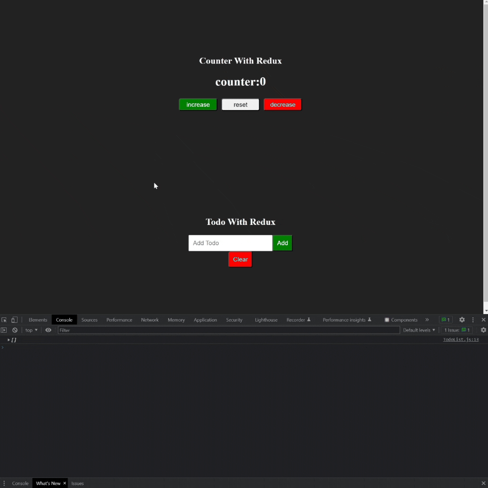

<div align=center>
	<h1>React Redux To-Do</h1>
</div>

<div align="center">
	<a href="https://react-redux-todo-ehkarabas.netlify.app/">
		
	</a>
	<br>
	
</div>

## Description

Simple react app for a simple counter and to-do list via react-redux.

## Goals

Practicing on components, external styling, local storage, react-redux, store(switch-case reducer, actions(types as object, functions returning predefined action objects for dispatch) useSelector, useDispatch, combineReducers hooks.

## Installation

To run this app on your local, run commands below on the terminal:

1. Clone main repo on your local.
    ```shell
    $ git clone https://github.com/ehkarabas/react-exercises.git
    ```

2. Install node modules to this sub-repo.
    ```shell
    $ yarn install
    
    or

    $ npm install
    ```

3. Run the app on your browser.
    ```shell
    $ yarn start
    
    or

    $ npm start
    ```

## Resource Structure 

```
react-redux-todo(folder)
|
|-- README.md
|-- package.json
|-- public
|   |-- images
|   |   |-- react-redux-todo-presentation.gif
|   |-- index.html
|-- src
|   |-- App.css
|   |-- App.js
|   |-- assets
|   |   |-- delete.png
|   |   |-- ok.png
|   |-- components
|   |   |-- counter
|   |   |   |-- Counter.css
|   |   |   |-- Counter.js
|   |   |-- todo
|   |       |-- Todo.css
|   |       |-- Todo.js
|   |       |-- TodoInput.js
|   |       |-- TodoItem.js
|   |       |-- TodoList.js
|   |-- index.js
|   |-- redux
|       |-- actions
|       |   |-- counterActions.jsx
|       |   |-- todoActions.jsx
|       |-- index.jsx
|       |-- reducers
|       |   |-- counterReducer.jsx
|       |   |-- todoReducer.jsx
|       |-- types
|           |-- counterTypes.js
|           |-- todoTypes.js
|-- yarn.lock
```


