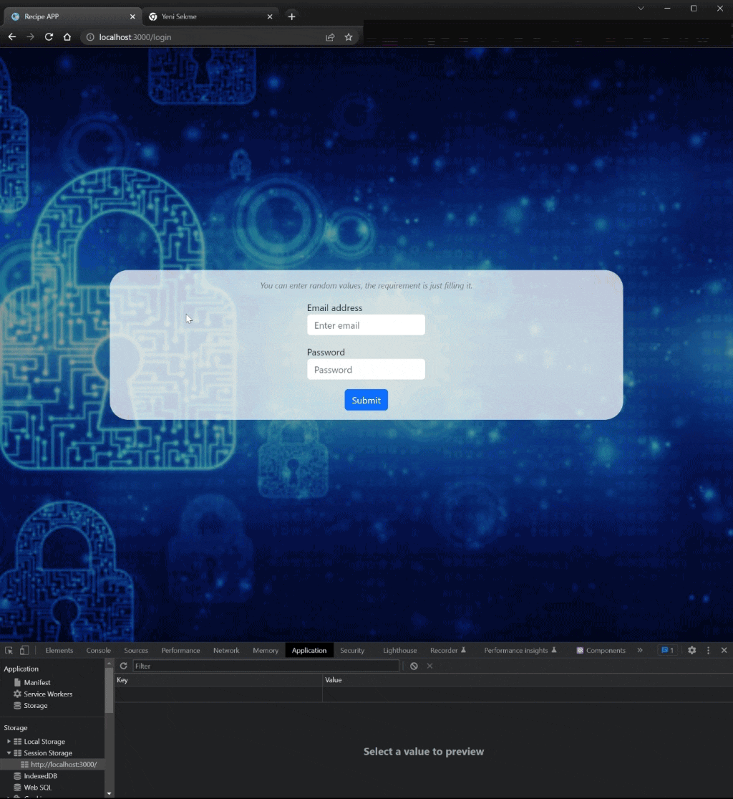

<div align=center>
	<h1>Recipe App</h1>
</div>

<div align="center">
	<a href="https://recipe-app-ehkarabas.netlify.app/">
		
	</a>
	<br>
	
</div>

## Description

A React app that simulates recipe websites that receive recipe data through an API and allow for querying recipes through different tabs. The system has a structure where it adds recipe names in a specific format to the end of the details URL based on their names in the API. When trying to access a recipe detail externally by entering a URL, the system compares the entered URL with the recipe names in the API in the specified format. If there is a match, the system allows the relevant product to be opened in the detail URL after redirection following a succesful login.

## Goals

Practicing on components, props, bootstrap, API(get with different query parameters of the API), react-router, .env(to hide API URL), styled components, SASS, useState, useEffect, useNavigate, useLocation, useParams and useContext(for login structure) hooks.

## Installation

To run this app on your local, run commands below on the terminal:

1. Clone main repo on your local.
    ```shell
    $ git clone https://github.com/ehkarabas/react-exercises.git
    ```

2. Install node modules to this sub-repo.
    ```shell
    $ yarn install
    
    or

    $ npm install
    ```

3. Run the app on your browser.
    ```shell
    $ yarn start
    
    or

    $ npm start
    ```

## Resource Structure 

```
recipe-app(folder)
|
|-- README.md
|-- package.json
|-- public
|   |-- images
|   |   |-- ehlogo-transparent.png
|   |   |-- recipe-app-presentation.gif
|   |-- index.html
|-- src
|   |-- App.js
|   |-- assets
|   |   |-- coding.svg
|   |   |-- default-image.jpg
|   |   |-- diet.svg
|   |   |-- home.svg
|   |   |-- mail.svg
|   |   |-- meal.svg
|   |   |-- meal2.svg
|   |-- components
|   |   |-- error
|   |   |   |-- Error.jsx
|   |   |   |-- error.scss
|   |   |-- header
|   |   |   |-- Form.jsx
|   |   |   |-- Header.jsx
|   |   |   |-- headerStyle.scss
|   |   |-- navbar
|   |   |   |-- Navbar.jsx
|   |   |   |-- navbarStyle.scss
|   |   |-- styled
|   |       |-- FlexRow.styled.js
|   |       |-- Image.styled.js
|   |-- context
|   |   |-- loginContext.js
|   |-- index.js
|   |-- index.scss
|   |-- pages
|   |   |-- about
|   |   |   |-- About.jsx
|   |   |   |-- aboutStyle.scss
|   |   |-- details
|   |   |   |-- Details.jsx
|   |   |   |-- detailsStyle.scss
|   |   |-- home
|   |   |   |-- Home.jsx
|   |   |   |-- RecipeCard.jsx
|   |   |   |-- homeStyle.scss
|   |   |-- login
|   |       |-- Login.jsx
|   |       |-- loginStyle.scss
|   |-- router
|   |   |-- AppRouter.js
|   |   |-- PrivateRouter.js
|   |-- scss
|       |-- _mixins.scss
|       |-- _reset.scss
|       |-- _variables.scss
|-- yarn.lock
```