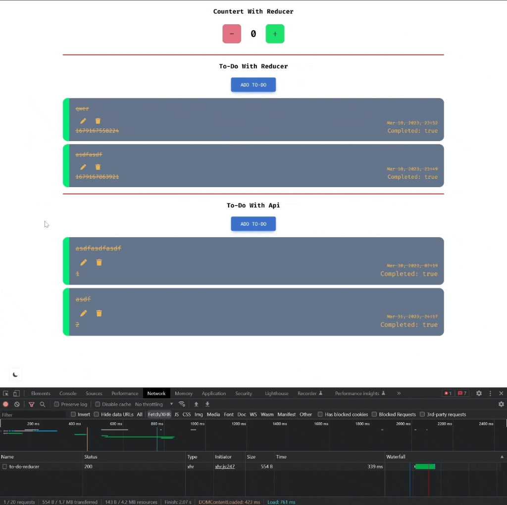

<div align=center>
	<h1>Reducer Exercise</h1>
</div>

<div align="center">
	<a href="https://reducer-exercise-ehkarabas.netlify.app/">
		
	</a>
	<br>
	
</div>

## Description

Simple react app to exercise on useReducer hook.

## Goals

Practicing on components, states, useState, useEffect, useReducer, API(get,post,put,delete), .env(to hide API URL), tailwind, theme toggling.

## Installation

To run this app on your local, run commands below on the terminal:

1. Clone main repo on your local.
    ```shell
    $ git clone https://github.com/ehkarabas/react-exercises.git
    ```

2. Install node modules to this sub-repo.
    ```shell
    $ yarn install
    
    or

    $ npm install
    ```

3. Run the app on your browser.
    ```shell
    $ yarn start
    
    or

    $ npm start
    ```

## Resource Structure 

```
reducer-exercise(folder)
|
|-- README.md
|-- package.json
|-- public
|   |-- images
|   |   |-- reducer-exercise-presentation.gif
|   |-- index.html
|-- src
|   |-- App.js
|   |-- components
|   |   |-- Counter.jsx
|   |   |-- apiTodos
|   |   |   |-- AddToDo.jsx
|   |   |   |-- EditToDo.jsx
|   |   |   |-- ToDos.jsx
|   |   |   |-- ToDosWithApi.jsx
|   |   |-- reducerTodos
|   |   |   |-- AddToDoReducer.jsx
|   |   |   |-- EditToDoReducer.jsx
|   |   |   |-- ToDosReducer.jsx
|   |   |   |-- ToDosWithReducer.jsx
|   |   |-- theme
|   |       |-- Switch.jsx
|   |-- helper
|   |   |-- ToastNotify.js
|   |-- index.css
|   |-- index.js
|-- tailwind.config.js
|-- yarn.lock
```


