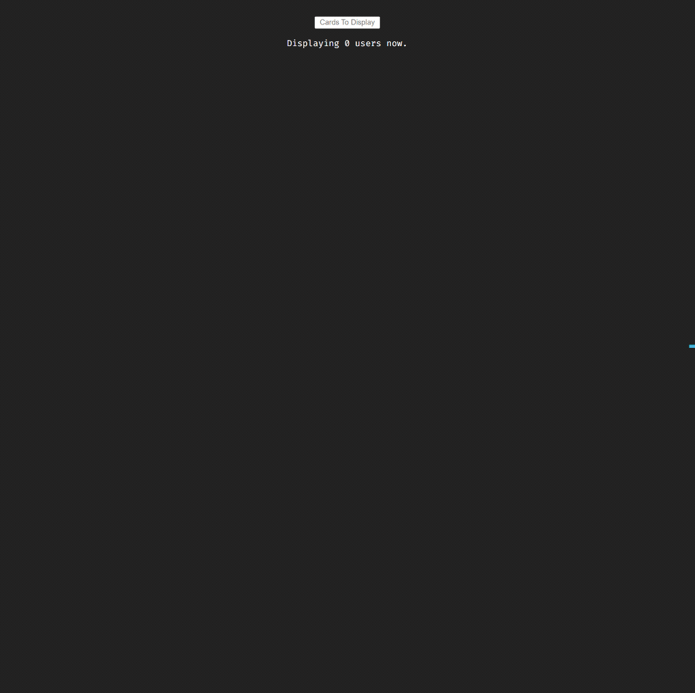

<div align=center>
	<h1>User Cards</h1>
</div>

<div align="center">
	<a href="https://user-cards-ehkarabas.netlify.app/">
		
	</a>
	<br>
	
</div>

## Description

Simple react app to render fetched users data from an API on UI with end-user's desired count of users cards feature.

## Goals

Practicing on components, props, fetching with axios, inline(with variables)/external styling, use state and use effect hooks.

## Installation

To run this app on your local, run commands below on the terminal:

1. Clone main repo on your local.
    ```shell
    $ git clone https://github.com/ehkarabas/react-exercises.git
    ```

2. Install node modules to this sub-repo.
    ```shell
    $ yarn install
    
    or

    $ npm install
    ```

3. Run the app on your browser.
    ```shell
    $ yarn start
    
    or

    $ npm start
    ```

## Resource Structure 

```
user-cards(folder)
|
|-- README.md
|-- package.json
|-- public
|   |-- images
|   |   |-- user-cards-presentation.gif
|   |-- index.html
|-- src
|   |-- App.js
|   |-- components
|   |   |-- Cards
|   |   |   |-- Cards.jsx
|   |   |   |-- cards.css
|   |   |-- Form
|   |       |-- Form.jsx
|   |-- index.css
|   |-- index.js
|-- yarn.lock
```


